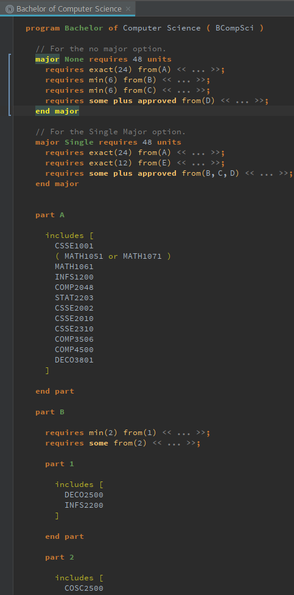
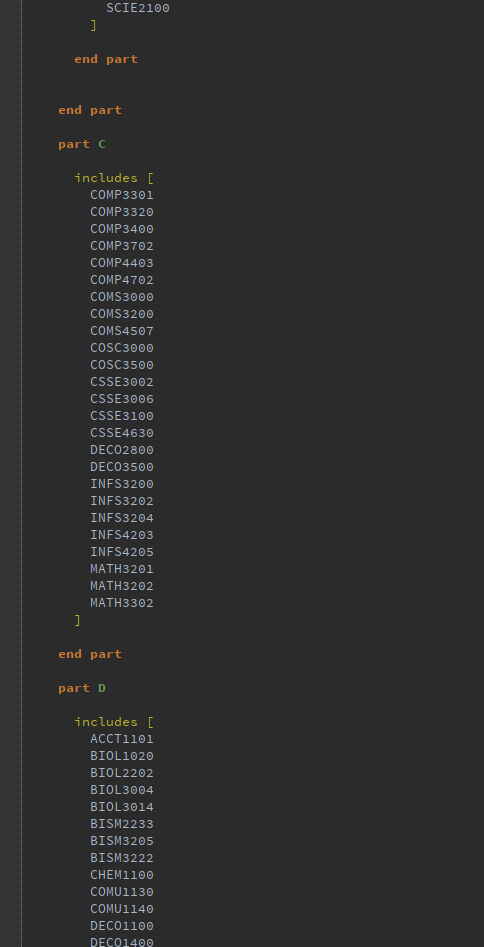
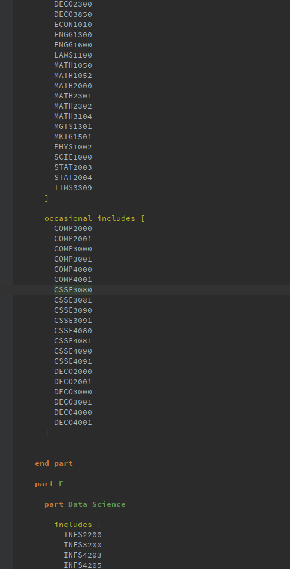
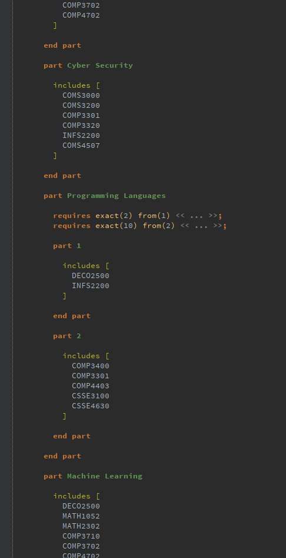
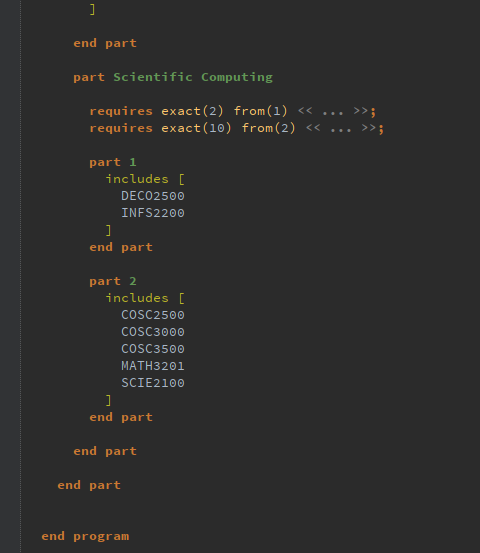

# A UQ Course Domain Specific Language for Degree Plans

This project is a proof of concept for a Domain Specific Language ( DSL ) for design degree plans at UQ. It offers functionality which should cover 90% of what is presented on the public course websites.

Example:
--------

The following is an example of a Bachelor of Computer Science degree which can be found here: https://my.uq.edu.au/programs-courses/program_list.html?acad_prog=2425

