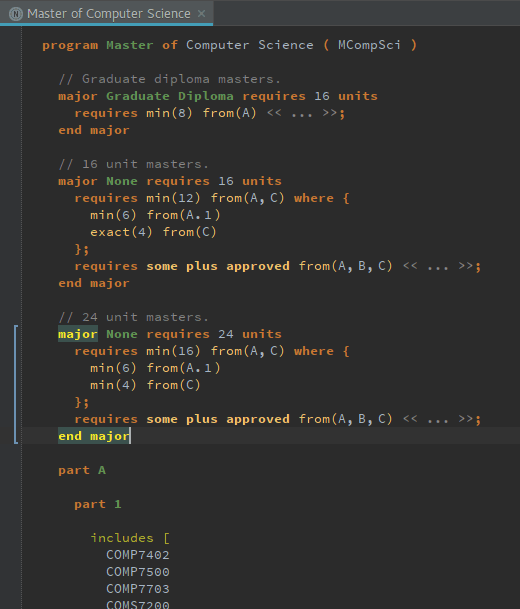
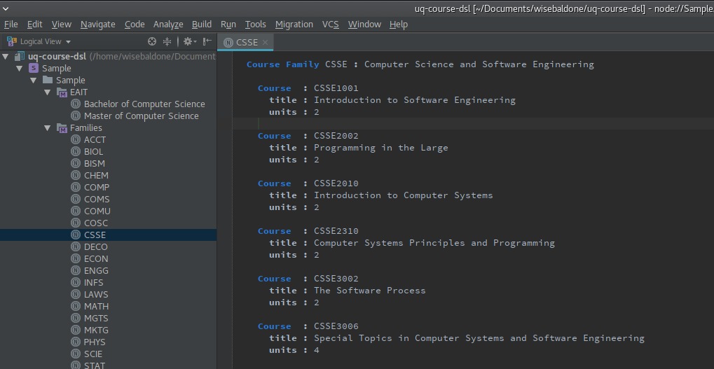

# A UQ Course Domain Specific Language for Degree Plans

This project is a proof of concept for a Domain Specific Language ( DSL ) for design degree plans at UQ. It offers functionality which should cover 90% of what is presented on the public course websites like https://my.uq.edu.au/programs-courses/program_list.html?acad_prog=2425

The project does **not** have any backend generation but could be used to generate the html code linked above or could output code or structured data ( xml, json ) to check whether a student's plan completes all the requirements of the degree. This functionality may be added in the future.

Jetbrains MPS was used as the IDE to construct the language and can be used to generate a custom IDE for the DSL aswell.

Example Course Description:
---------------------------

Courses need to be described to the system first before they can be used in plans. This is done by creating a Course Family which is denoted by the first 4 letters of the course. Next the full name of the 4 letter abbreviation is given.

Following on below the course family definition are individual course blocks. A course Block is made out of a name, title and the units of the course. The name is the 8 digit long code comprising of the Family signature and a numerical code.

An example can be seen below:

Example Degree/Program Plan:
----------------------------

Program Plans are more difficult to put together but are also written in a more programming language style than just a custom expression of a data structure even though ultimately that's what it is.

First a program is created in the project pane like the pane viewed above under Sample/Sample/Bachelor of Computer Science. A plan has a Plan Type and a Name; these characteristics give enough uniqueness for the proof of concept. The shorthand notation of the degree is also available in the circle brackets within the first line.

Following on the internal block is a free roam space where comments and Majors/Parts can be defined. In the examples below two majors are defined. A "none" major which is a degree that does not specify and a "single" major. Other built in options include "Dual" and "Graduate Diploma". See the Masters example in the images folder for the Graduate Diploma.

Parts can also be defined at the root program level and include a name and include subjects within them. See the example below for Parts as they are quite simple.

Within the Parts and Major definitions there can be requirements. These are used to determine what courses need to be done to be able to graduate with the major and use a sql like syntax. Viewing the example below and the Masters example shows all the available syntax for the first param ( min/max/exact/some/some plus approved ) and the from clause can contain sub parts like A.1 where 1 is a part defined within A.

The following is an example of a Bachelor of Computer Science degree which can be found here: https://my.uq.edu.au/programs-courses/program_list.html?acad_prog=2425

